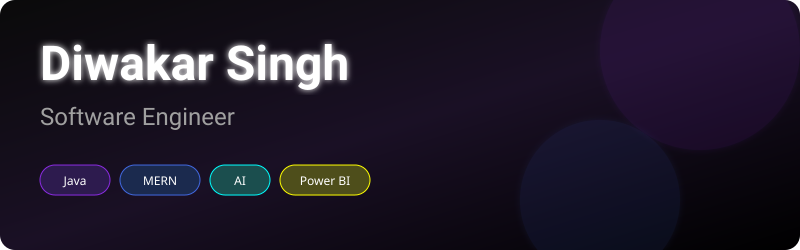

 

  
  
  
  

---

## 👨🏻‍💻 About Me

I am a passionate **Software Engineer** specializing in full-stack development, backend systems, and data analytics. I love solving complex engineering problems and building scalable, user-centric applications.

- 🔭 **Current Focus:** Data Structures & Algorithms, System Design, Spring Boot, Docker, AWS, Open Source
- 🌱 **Learning:** Advanced System Architecture, Cloud Native Applications
- 💬 **Ask me about:** Java, React, Node.js, MERN Stack, Data Analytics
- ⚡ **Fun fact:** I believe every complex problem has a beautiful, simple solution hiding within it.

 

## 🛠️ Tech Stack & Skills

### Languages

### Frameworks & Libraries

### Databases & Cloud

### DevOps & Tools

 

## 🚀 Featured Projects

| 🤖 Intervix AI | 🎨 HueHaven |
| :--- | :--- |
| **AI Interview Platform** Built with React, Node, Express, MongoDB. *Next-generation mock interview platform powered by AI.* | **Java GUI Application** Built with Java Swing, MySQL. *Elegant color palette generator and management system.* |
| [View Repository](https://github.com/diwakar1215/Intervix-AI) | [View Repository](https://github.com/diwakar1215/HueHaven) |

| 🏦 Banking System | 📊 India GDP Dashboard |
| :--- | :--- |
| **Full Stack FinTech App** MERN Stack implementation. *Secure, scalable banking management solution.* | **Data Analytics** Power BI visualization. *Comprehensive analytical dashboard for economic data.* |
| [View Repository](https://github.com/diwakar1215/Banking-System) | [View Repository](https://github.com/diwakar1215/PowerBi-Projects) |

 

## 📈 GitHub Statistics

 

  

### 🐍 Contribution Snake

<picture>
  <source media="(prefers-color-scheme: dark)" srcset="https://raw.githubusercontent.com/diwakar1215/diwakar1215/output/github-contribution-grid-snake-dark.svg">
  <source media="(prefers-color-scheme: light)" srcset="https://raw.githubusercontent.com/diwakar1215/diwakar1215/output/github-contribution-grid-snake.svg">
  
</picture>

 

## 🏆 Coding Profiles

  
  
  

 

  
> *"Code is like humor. When you have to explain it, it’s bad."* — Cory House

 

<a href="#top">Back to Top ⬆️</a>

